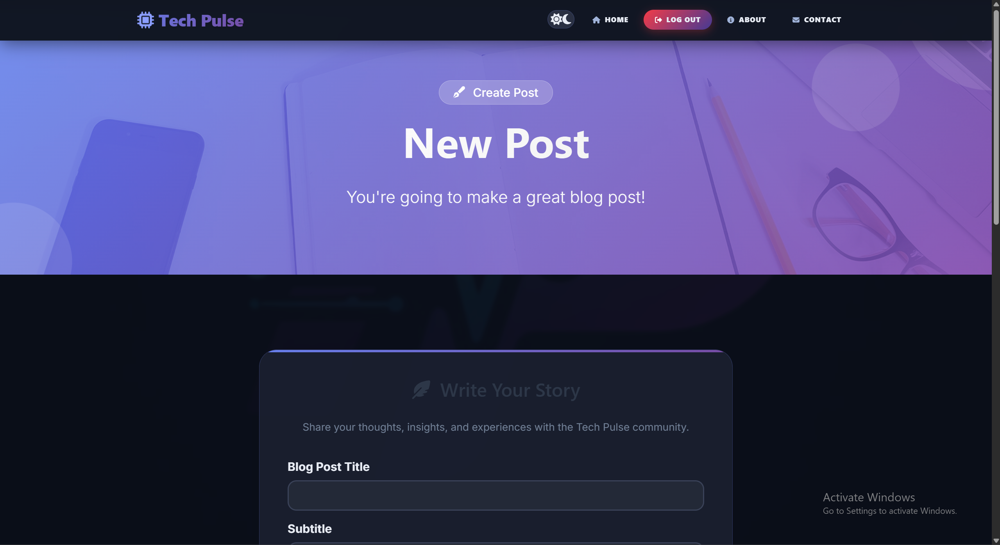
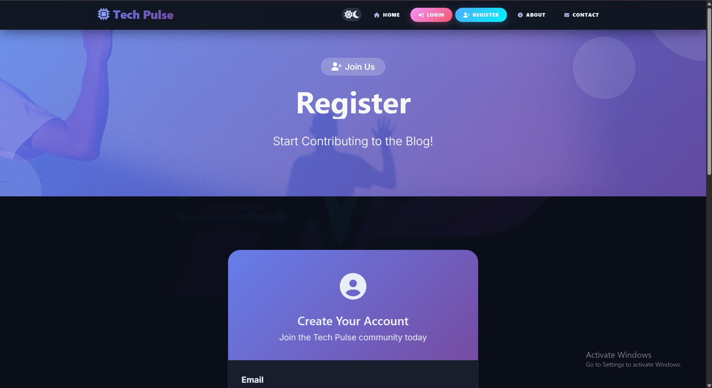
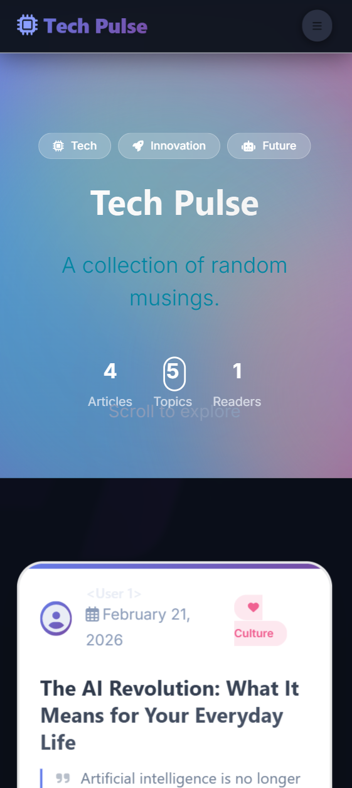

# Tech Pulse Blog

A modern, full-featured blog platform built with Flask. Features user authentication, dark mode, responsive design, and complete blog post management.

🔗 **Live Demo:** [https://blog-1dlm.onrender.com/](https://blog-1dlm.onrender.com/)

---

## 📸 Screenshots

<div align="center">
  
### 🏠 Home Page

<p><em>Clean homepage with hero section and blog post cards</em></p>

### 📝 Blog Post View

<p><em>Formatted blog posts with comments section</em></p>

### 🔐 Register Page

<p><em>User registration with modern form design</em></p>

### 📱 Mobile View

<p><em>Fully responsive design on all devices</em></p>

</div>

---

## ✨ Features

### 🎨 Design & UI
| Feature | Description |
|---------|-------------|
| Modern Interface | Clean design with gradient accents |
| Dark Mode | Manual toggle with localStorage persistence |
| Responsive | Works on mobile, tablet, and desktop |
| Glassmorphism | Backdrop blur effects and smooth animations |

### 👤 User Features
- User authentication (Login/Register)
- Comment system with Gravatar integration
- Profile management
- Read time estimates on posts

### 📝 Blog Features
- Create, edit, and delete posts (admin only)
- Rich text editor with CKEditor
- Post categories and tags
- Comment section on each post
- Post statistics

### 🌓 Dark Mode
- Manual toggle with sun/moon icons in navbar
- Saves user preference in browser
- Respects system preferences
- Optimized colors for readability

### 📱 Mobile First
- Stacked cards on mobile
- Touch-friendly buttons
- Optimized typography
- Collapsible navigation menu

---

## 🛠 Technology Stack

<details>
<summary><b>Backend</b></summary>
<br>
  
- Python 3.9+
- Flask - Web framework
- Flask-Login - User session management
- Flask-WTF - Form handling
- Flask-SQLAlchemy - Database ORM
- Flask-CKEditor - Rich text editing
- Werkzeug - Security utilities
- Gunicorn - WSGI HTTP Server
</details>

<details>
<summary><b>Frontend</b></summary>
<br>
  
- Bootstrap 5 - Responsive framework
- Font Awesome 6 - Icons
- Google Fonts (Inter) - Typography
- AOS Library - Scroll animations
- CSS3 - Custom styling with variables
- JavaScript - Interactive features
</details>

<details>
<summary><b>Database & Deployment</b></summary>
<br>
  
- SQLite (Development)
- PostgreSQL (Production on Render)
- Render - Cloud platform
- Gunicorn - Production server
- GitHub - Version control
</details>

---

## 🚀 Deploy on Render

### 1. Prepare Your Application

Create a file named `Procfile` in your root directory:

```
web: gunicorn main:app
```

### 2. Deploy on Render

| Step | Action |
|------|--------|
| 1 | Push your code to GitHub |
| 2 | Go to [render.com](https://render.com) and create account |
| 3 | Click "New" → "Web Service" |
| 4 | Connect your GitHub repository |
| 5 | Configure: |
| | **Name:** `tech-pulse-blog` |
| | **Environment:** `Python 3` |
| | **Build Command:** `pip install -r requirements.txt` |
| | **Start Command:** `gunicorn main:app` |

### 3. Environment Variables

Add these in Render Dashboard:

```bash
SECRET_KEY=your-secret-key-here
DATABASE_URL=your-postgresql-database-url
```

---

## 💻 Local Development

### Prerequisites
- Python 3.9 or higher
- pip package manager
- Virtual environment (recommended)

### Installation Steps

1. **Clone the repository**
   ```bash
   git clone https://github.com/abrilohd/Blog.git
   cd tech-pulse-blog
   ```

2. **Create and activate virtual environment**
   ```bash
   # Windows
   python -m venv venv
   venv\Scripts\activate
   
   # Mac/Linux
   python3 -m venv venv
   source venv/bin/activate
   ```

3. **Install dependencies**
   ```bash
   pip install -r requirements.txt
   ```

4. **Set up environment variables**
   
   Create a `.env` file:
   ```bash
   SECRET_KEY=your-development-secret-key
   ```

5. **Initialize the database**
   ```bash
   python
   >>> from main import app, db
   >>> with app.app_context():
   ...     db.create_all()
   >>> exit()
   ```

6. **Run the application**
   ```bash
   python main.py
   ```

7. **Visit the application**
   
   Open http://127.0.0.1:5000 in your browser

---

## 📁 Project Structure

```
tech-pulse-blog/
├── 📂 screenshots/
│   ├── home.png
│   ├── post.png
│   ├── register.png
│   └── mobile.png
├── 📂 static/
│   ├── 📂 assets/
│   │   └── 📂 img/
│   ├── 📂 css/
│   │   └── styles.css
│   └── 📂 js/
│       └── scripts.js
├── 📂 templates/
│   ├── header.html
│   ├── index.html
│   ├── post.html
│   ├── about.html
│   ├── contact.html
│   ├── login.html
│   ├── register.html
│   ├── make-post.html
│   └── footer.html
├── main.py
├── models.py
├── forms.py
├── requirements.txt
├── Procfile
├── README.md
└── .env
```

---

## 🔑 Key Features Explained

<details>
<summary><b>🌓 Dark Mode Implementation</b></summary>
<br>
  
The dark mode uses CSS variables and localStorage for persistence:
- Toggle with sun/moon icons in navbar
- Saves user preference in browser
- Automatically respects system preferences
- Smooth transitions between modes
</details>

<details>
<summary><b>📝 Blog Post Management</b></summary>
<br>
  
- Admin-only post creation/deletion
- Rich text editing with CKEditor
- Automatic date stamping
- Author attribution
- Read time estimates
</details>

<details>
<summary><b>💬 Comment System</b></summary>
<br>
  
- Gravatar integration for user avatars
- Timestamps on all comments
- Form validation
- Like and reply functionality
</details>

<details>
<summary><b>📱 Responsive Design</b></summary>
<br>
  
- Mobile-first approach
- Two-column layout on desktop
- Stacked cards on mobile
- Touch-friendly interface
</details>

---

## 🧪 Testing

Run the application locally and test:

- [ ] User registration and login
- [ ] Creating/editing posts (admin)
- [ ] Adding comments
- [ ] Dark mode toggle
- [ ] Responsive design on different devices
- [ ] All navigation links

---

## 🤝 Contributing

1. Fork the repository
2. Create a feature branch (`git checkout -b feature/AmazingFeature`)
3. Commit your changes (`git commit -m 'Add some AmazingFeature'`)
4. Push to the branch (`git push origin feature/AmazingFeature`)
5. Open a Pull Request

---

## 📄 License

This project is for educational purposes as part of the "100 Days of Code" challenge.

---

## 👨‍💻 Author

**Your Name**
- GitHub: [@abrilohd](https://github.com/abrilohd)
- Twitter: [@abrsh067](https://x.com/abrsh067)

---

## 🙏 Acknowledgments

- [100 Days of Code Course](https://www.udemy.com/course/100-days-of-code/)
- [Bootstrap 5 Documentation](https://getbootstrap.com/docs/5.0/)
- [Flask Documentation](https://flask.palletsprojects.com/)
- [Render Hosting Platform](https://render.com/)

---

## 📊 Project Status

| Status | Details |
|--------|---------|
| ✅ Complete | Deployed and running |
| 🔄 Updates | Regular maintenance |
| 🐛 Issues | Bug reports welcome |

---

<div align="center">
  <strong>Made with ❤️ and Python</strong>
  <br>
  <br>
  
  
  
  
</div>

---

## 🚀 Quick Start

```bash
# Clone the repository
git clone https://github.com/abrilohd/Blog.git

# Navigate to project
cd tech-pulse-blog

# Install dependencies
pip install -r requirements.txt

# Run the app
python main.py
```

---

## 📞 Contact

Have questions? Feel free to reach out:
- Open an issue on GitHub
- Contact through the website's contact form
- Follow on Twitter for updates

---

<div align="center">
  <sub>Built with ⚡ during the 100 Days of Code challenge</sub>
</div>
```