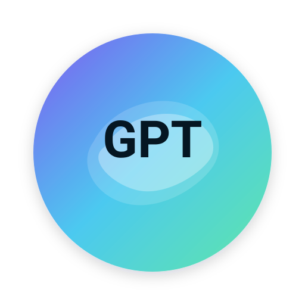

# 🐍 100 Days of Code – Python

> **A documented learning journey: Building strong Python fundamentals through daily practice & real projects**


---

100 Days of Code — Python (at a glance)

-  Beginning — Start coding  
  Learned Python fundamentals: syntax, I/O, control flow, and core data structures.

-  Then — Bigger projects  
  Built progressively larger projects that culminate in a deployable blog capstone.

-  Games  
  Created small games like Hangman, Blackjack, and Snake to practice logic and OOP.

-  Automation & Web Scraping  
  Worked with BeautifulSoup and Selenium for browser automation and data extraction.

-  Data Analysis & Visualization  
  Used pandas, NumPy, matplotlib and seaborn for data cleaning, exploration, and charts.

-  Machine Learning (intro)  
  Explored linear regression and the Boston housing example as an entry to ML.

-  Python Executable / GUI Apps  
  Built desktop/GUI examples and learned how to package Python apps.

-  Full Web Apps with Flask  
  Implemented templating (Jinja), authentication, REST APIs, and deployment for real web projects.

-  AI Integrations  
  Added simple API/chatbot integrations to demonstrate basic AI usage.

Explore the repo: https://github.com/abrilohd/100-days-of-code-python

---

## 🎯 Challenge Overview

This repository documents my **100 Days of Code** challenge, where I practice Python daily and build real mini-projects to solidify fundamentals.

### Goals
- ✅ Build strong Python fundamentals
- ✅ Practice consistently every day
- ✅ Create real, functional mini-projects
- ✅ Learn best practices through projects
- ✅ Document learning progress

---

## 📚 Learning Path

### Phase 1: Fundamentals (Days 1-20)
- Print statements & string manipulation
- Variables & data types
- User input & type conversion
- Conditional statements (if/else)
- Loops (for/while)
- Lists & dictionaries

**Mini-Projects:**
- BMI Calculator
- Grade Calculator
- Rock Paper Scissors Game

### Phase 2: Functions & Scope (Days 21-40)
- Function definition & calling
- Parameters & return values
- Variable scope
- Recursion basics
- Lambda functions
- List comprehensions

**Mini-Projects:**
- Password Generator
- Number Guessing Game
- Caesar Cipher

### Phase 3: Data Structures (Days 41-60)
- Lists & operations
- Dictionaries & nested structures
- Tuples & sets
- String methods
- File I/O
- JSON handling

**Mini-Projects:**
- File-based Task Manager
- Data Analyzer
- Contact Book

### Phase 4: OOP Concepts (Days 61-80)
- Classes & objects
- Inheritance
- Encapsulation
- Polymorphism
- Magic methods
- Decorators

**Mini-Projects:**
- Bank System
- Game with Classes
- Todo App

### Phase 5: Advanced Topics (Days 81-100)
- Exception handling
- Modules & packages
- APIs & requests
- Testing & debugging
- Performance optimization
- Best practices review

**Final Projects:**
- Weather App
- Web Scraper
- Chat Bot

---

## 📁 Directory Structure

```
100-days-of-code-python/
├── Day 1 - start_coding/
│   ├── Day1print.py        # Code file
│   └── README.md           # Daily notes
├── Day 2 - input_in_python/
│   ├── Day2BMI.py
│   ├── Day2Note            # Learning notes
│   └── README.md
├── Day 3 - data_types/
├── ...
├── Day 100 - final_project/
│   └── README.md
├── mini-projects/          # Consolidated projects
│   ├── password_generator/
│   ├── game_rock_paper_scissors/
│   ├── task_manager/
│   └── weather_app/
├── notes/                  # General learning notes
│   ├── data_types.md
│   ├── functions.md
│   ├── oop_basics.md
│   └── best_practices.md
└── README.md
```

---

## 🚀 Getting Started

### Prerequisites
- Python 3.8+
- Text editor or IDE (VS Code, PyCharm, etc.)
- Terminal/Command prompt

### Run Daily Code

```bash
# Navigate to repository
cd 100-days-of-code-python

# Run a specific day's code
python "Day 1 start_coding/Day1print.py"

# Run a mini-project
python mini-projects/password_generator/main.py

# Run tests (if available)
pytest tests/
```

---

## 📖 Daily Notes & Learnings

### Day 1: Hello & Inputs
- Learned: `print()`, string concatenation, `input()`
- Key Concept: Basic output and user interaction
- [View Day 1 Notes](./Day%201%20start_coding/README.md)

### Day 2: BMI Calculator
- Learned: Type conversion, arithmetic operations
- Key Concept: Converting user input to numbers
- Formula: BMI = weight / (height × height)
- [View Day 2 Notes](./Day%202%20input_in_python/README.md)

### Day 3: Control Flow
- Learned: If/else statements, comparison operators
- Key Concept: Making decisions in code

**See individual day folders for detailed notes!**

---

## 💡 Key Learnings

### Python Fundamentals
```python
# Variables & Types
name = "Abrham"              # String
age = 25                     # Integer
gpa = 3.8                    # Float
is_student = True            # Boolean

# Data Structures
numbers = [1, 2, 3]          # List
coords = (10, 20)            # Tuple
person = {"name": "Abrham"}  # Dictionary

# Control Flow
if score > 80:
    print("Excellent!")
elif score > 60:
    print("Good!")
else:
    print("Try again!")

# Loops
for i in range(5):
    print(i)

while True:
    user_input = input("Enter command: ")
    if user_input == "exit":
        break

# Functions
def greet(name):
    return f"Hello, {name}!"

# List Comprehension
squares = [x**2 for x in range(10)]

# Exception Handling
try:
    result = 10 / 0
except ZeroDivisionError:
    print("Can't divide by zero!")

# File I/O
with open("data.txt", "r") as f:
    content = f.read()
```

---

## 🏗️ Mini-Projects

### 1. BMI Calculator
**Concepts:** Input validation, arithmetic, conditionals
```bash
cd mini-projects/bmi_calculator
python main.py
```

### 2. Rock Paper Scissors
**Concepts:** Loops, conditionals, random module
```bash
cd mini-projects/rock_paper_scissors
python main.py
```

### 3. Password Generator
**Concepts:** String manipulation, random, loops
```bash
cd mini-projects/password_generator
python main.py
```

### 4. Task Manager
**Concepts:** File I/O, lists, functions, data persistence
```bash
cd mini-projects/task_manager
python main.py
```

### 5. Weather App
**Concepts:** APIs, JSON, requests, error handling
```bash
cd mini-projects/weather_app
python main.py
```

---

## 📊 Progress Tracking

| Phase | Days | Status | Focus |
|-------|------|--------|-------|
| Fundamentals | 1-20 | ✅ Complete | Basics & IO |
| Functions | 21-40 | ✅ Complete | Functions & Scope |
| Data Structures | 41-60 | ✅ Complete | Collections & Files |
| OOP | 61-80 | ⏳ In Progress | Classes & Inheritance |
| Advanced | 81-100 | 🔜 Coming | APIs & Best Practices |

---

## 🎓 Best Practices Learned

### Code Quality
- ✅ Use meaningful variable names
- ✅ Add comments for complex logic
- ✅ Keep functions small & focused
- ✅ DRY (Don't Repeat Yourself)
- ✅ Handle exceptions gracefully

### Python Style (PEP 8)
```python
# Good
def calculate_bmi(weight, height):
    """Calculate BMI from weight (kg) and height (m)."""
    return weight / (height ** 2)

# Bad
def calc(w,h):
    return w/(h**2)
```

### Testing
```python
# Write tests for your code
def test_bmi_calculator():
    assert calculate_bmi(70, 1.75) == pytest.approx(22.86)
    assert calculate_bmi(100, 1.8) == pytest.approx(30.86)
```

---

## 🔗 Resources Used

### Documentation
- [Python Official Docs](https://docs.python.org/3/)
- [PEP 8 Style Guide](https://www.python.org/dev/peps/pep-0008/)
- [Real Python](https://realpython.com/)

### Learning Platforms
- Python tutorials
- Online coding challenges
- Project-based learning

### Tools
- VS Code + Python extension
- PyCharm Community
- Jupyter Notebooks

---

## 🤝 Contributing

Want to add improvements or fix issues?

1. Fork the repository
2. Create a feature branch (`git checkout -b improve/day-50`)
3. Make your changes
4. Commit (`git commit -m 'Improve day 50 explanation'`)
5. Push and open a PR

---

## 💬 Questions & Discussion

- 🐛 **Report Issues:** Open an issue on GitHub
- 💡 **Share Ideas:** Start a discussion
- 📧 **Contact:** abrsh067@gmail.com

---

## 📄 License

This project is open source and available under the MIT License.

---

## 🙏 Acknowledgments

- Python community for great documentation
- Online tutorials & resources
- Inspiration from 100DaysOfCode challenge
- Everyone who provided feedback

---

## 📈 Statistics

- **Days Completed:** 20+ (ongoing)
- **Mini-Projects:** 5+
- **Lines of Code:** 2,000+
- **Concepts Covered:** 50+

---

## 🎯 Next Steps

- [ ] Complete days 81-100
- [ ] Build capstone project
- [ ] Contribute to open source
- [ ] Start async/await concepts
- [ ] Learn Django framework
- [ ] Build web application

---

**Ready to learn Python? Start from Day 1 and follow along!**

🖥️ Learning one day at a time.

Built with ❤️ through consistent daily practice.
