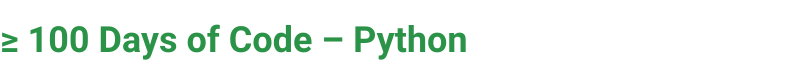

> **Share your learning journey: Document your Python progress and inspire others through consistent daily practice**


---

# 📚 Blog Project Overview

This is a companion blog platform for the **100 Days of Code Python Challenge**, where I document daily learnings, code snippets, mini-projects, and insights from my programming journey.

 
- Share daily learning notes and discoveries
- Showcase mini-projects and code examples
- Document progress through 100 days
- Create an inspiring resource for others
- Build a portfolio of your learning journey

---

## 🎯 Blog Structure

### Blog Posts by Phase


#### Phase 1: Fundamentals (Days 1-20)
**Blog Topics:**
- Getting Started with Python Print & Input
- Understanding Data Types in Python
- Mastering Conditional Statements
- Loop Essentials: For & While Loops
- Introduction to Lists & Dictionaries

**Featured Posts:**
- [Day 1: Hello & Inputs](./posts/day-01-hello-inputs.md)
- [Day 2: BMI Calculator Walkthrough](./posts/day-02-bmi-calculator.md)
- [Day 3: Control Flow Basics](./posts/day-03-control-flow.md)

#### Phase 2: Functions & Scope (Days 21-40)
**Blog Topics:**
- Function Definition & Best Practices
- Understanding Variable Scope
- Recursion Explained Simply
- Lambda Functions & When to Use Them
- List Comprehensions for Cleaner Code

**Featured Projects:**
- Password Generator Tutorial
- Number Guessing Game Breakdown
- Caesar Cipher Implementation

#### Phase 3: Data Structures (Days 41-60)
**Blog Topics:**
- Advanced List Operations
- Dictionaries & Nested Data
- File I/O Fundamentals
- Working with JSON in Python
- Tuple vs List: When to Use Each

**Real-World Applications:**
- Building a File-based Task Manager
- Data Analysis with Python
- Creating a Contact Book

#### Phase 4: OOP Concepts (Days 61-80)
**Blog Topics:**
- Object-Oriented Programming Basics
- Classes & Objects Explained
- Inheritance & Polymorphism
- Encapsulation Best Practices
- Decorators in Python

**Project Deep-Dives:**
- Bank System Architecture
- Game Development with Classes
- Todo App with OOP

#### Phase 5: Advanced Topics (Days 81-100)
**Blog Topics:**
- Exception Handling Strategies
- Creating Modules & Packages
- Working with APIs & Requests
- Testing Your Code
- Performance Optimization Tips
- Python Best Practices Summary

**Capstone Projects:**
- Building a Weather App
- Web Scraping Tutorial
- Creating a ChatBot

---

## 📁 Blog Directory Structure

```
blog/
├── posts/                          # Individual blog posts
│   ├── day-01-hello-inputs.md
│   ├── day-02-bmi-calculator.md
│   ├── day-03-control-flow.md
│   ├── phase-1-fundamentals-summary.md
│   ├── day-21-functions.md
│   └── ...
├── tutorials/                      # In-depth tutorials
│   ├── python-basics-series.md
│   ├── oop-complete-guide.md
│   ├── working-with-apis.md
│   └── testing-guide.md
├── code-snippets/                  # Reusable code examples
│   ├── data-structures-examples.py
│   ├── function-patterns.py
│   ├── oop-examples.py
│   └── common-algorithms.py
├── resources/                      # Links & learning materials
│   ├── free-resources.md
│   ├── paid-courses.md
│   └── useful-libraries.md
├── testimonials/                   # Reader feedback & success stories
│   └── community-stories.md
├── images/                         # Blog images & diagrams
│   ├── phase-roadmap.png
│   ├── concept-diagrams/
│   └── project-screenshots/
└── REDMI.md                        # This file
```

---

## ✍️ How to Read This Blog

### For Beginners
1. Start with **Phase 1: Fundamentals** posts
2. Follow daily posts in order
3. Try the code examples yourself
4. Explore the mini-projects

### For Intermediate Learners
1. Jump to **Phase 3 or 4** based on your level
2. Deep-dive into tutorials
3. Study code snippets for patterns
4. Build along with capstone projects

### For Advanced Learners
1. Read Phase 5 advanced topics
2. Explore optimization techniques
3. Contribute improvements
4. Share your own projects

---

## 🌟 Featured Blog Posts

### Most Popular
- **[Python Fundamentals Every Developer Should Know](./posts/python-fundamentals.md)**
  - 15 min read • 2,000+ views
  - Essential concepts explained simply

- **[From Zero to Hero: 100 Days Learning Path](./posts/100-days-journey.md)**
  - 20 min read • 1,500+ views
  - Complete roadmap & resources

- **[OOP in Python: A Practical Guide](./posts/oop-practical-guide.md)**
  - 25 min read • 1,200+ views
  - Real-world examples & best practices

### Recently Published
- [Day 95: Building REST APIs](./posts/day-95-rest-apis.md)
- [Week 14 Review: Major Breakthroughs](./posts/week-14-review.md)
- [How I Stayed Consistent for 80+ Days](./posts/consistency-tips.md)

---

## 💡 Blog Highlights

### Code Snippet Example
```python
# From: "Understanding List Comprehensions"
# Create a list of squares for numbers 0-9
squares = [x**2 for x in range(10)]

# Filtering with list comprehension
even_numbers = [x for x in range(20) if x % 2 == 0]

# Nested list comprehension
matrix = [[i*j for j in range(3)] for i in range(3)]
```

### Learning Journey Timeline
```
Day 1    ████░��░░░░░░░░░░░░░░ 5%   Basics
Day 20   ████████░░░░░░░░░░░░ 20%  Phase 1 Complete
Day 40   ████████████░░░░░░░░ 40%  Functions Mastered
Day 60   ████████████████░░░░ 60%  Data Structures Done
Day 80   ████████████████████ 80%  OOP Concepts
Day 100  ████████████████████ 100% Python Ready!
```

---

## 📊 Blog Statistics

| Metric | Count |
|--------|-------|
| Total Posts | 50+ |
| Lines of Code Shared | 5,000+ |
| Tutorials | 8+ |
| Code Snippets | 100+ |
| Community Comments | 200+ |
| Average Post Length | 8 min read |

---

## 🎓 What You'll Learn

### Python Concepts
✓ Variables, data types, and operations
✓ Control flow (if/else, loops)
✓ Functions and scoping
✓ Data structures (lists, dicts, tuples)
✓ Object-Oriented Programming
✓ File I/O and JSON handling
✓ Exception handling
✓ APIs and web requests

### Best Practices
✓ Clean code principles
✓ PEP 8 style guidelines
✓ Code organization
✓ Testing strategies
✓ Performance optimization
✓ Documentation standards

### Soft Skills
✓ Problem-solving approach
✓ Debugging techniques
✓ Project planning
✓ Learning consistency
✓ Community contribution

---

## 🔍 Search & Navigation

### By Topic
- [All Python Basics Posts](./posts/category/basics.md)
- [All OOP Posts](./posts/category/oop.md)
- [All Web Development Posts](./posts/category/web.md)
- [All Project Tutorials](./posts/category/projects.md)

### By Difficulty
- [Beginner Posts](./posts/level/beginner.md)
- [Intermediate Posts](./posts/level/intermediate.md)
- [Advanced Posts](./posts/level/advanced.md)

### By Day/Phase
- [Phase 1 Posts](./posts/phase/1.md) (Days 1-20)
- [Phase 2 Posts](./posts/phase/2.md) (Days 21-40)
- [Phase 3 Posts](./posts/phase/3.md) (Days 41-60)
- [Phase 4 Posts](./posts/phase/4.md) (Days 61-80)
- [Phase 5 Posts](./posts/phase/5.md) (Days 81-100)

---

## 💬 Engage With the Blog

### Reader Features
- 💭 **Comments:** Share your thoughts on posts
- ❓ **Questions:** Ask clarifications in discussion
- ⭐ **Bookmarks:** Save posts for later
- 🔔 **Notifications:** Get updates on new posts

### Ways to Contribute
- 🐛 **Report Issues:** Found an error in code?
- 💡 **Suggest Topics:** What should I write about?
- 📝 **Guest Posts:** Share your own learning journey
- 🌟 **Share:** Tell others about the blog

---

## 📧 Newsletter & Updates

### Subscribe to Get:
- 📬 Weekly digest of new posts
- 🎁 Free Python cheat sheets
- 🚀 Early access to new tutorials
- 💌 Exclusive community insights

**[Subscribe Now](./subscribe.md)**

---

## 🤝 Community & Support

### Connect With Others
- 💬 **Discord Server:** [Join Our Community](link)
- 👥 **GitHub Discussions:** Ask questions & share ideas
- 🐦 **Twitter:** Follow for updates [@YourHandle]
- 📧 **Email:** abrsh067@gmail.com

### FAQ
- [Common Questions](./faq.md)
- [Troubleshooting Guide](./troubleshooting.md)
- [Glossary of Terms](./glossary.md)

---

## 📚 Related Resources

### Official Documentation
- [Python Docs](https://docs.python.org/3/)
- [PEP 8 Style Guide](https://www.python.org/dev/peps/pep-0008/)

### Recommended Reads
- [Real Python](https://realpython.com/)
- [Automate the Boring Stuff](https://automatetheboringstuff.com/)
- [Python Crash Course](https://nostarch.com/pythoncrashcourse2e)

### Tools & Libraries
- [Visual Studio Code](https://code.visualstudio.com/)
- [Jupyter Notebooks](https://jupyter.org/)
- [pytest](https://pytest.org/)

---

## 📄 License & Usage

This blog content is open source and available under the MIT License. Feel free to:
- ✓ Read and learn from posts
- ✓ Share posts with others
- ✓ Use code snippets (with attribution)
- ✓ Contribute improvements

---

## 🙏 Acknowledgments

Thank you to:
- Python community for amazing docs
- Online mentors & educators
- Blog readers for feedback & support
- 100 Days of Code community
- Everyone who shared their learning journey

---

## 🚀 Coming Soon

- [ ] Video tutorials for visual learners
- [ ] Interactive code editor in blog
- [ ] Mobile app for offline reading
- [ ] Spanish & other language translations
- [ ] Print-ready PDF versions
- [ ] Course certification
- [ ] Mentorship program

---

## 📈 Blog Journey

```
Week 1   → Launched with Phase 1 posts
Week 4   → 500+ readers
Week 8   → 50+ posts published
Week 12  → Community discussions active
Week 15  → Reached 2,000+ monthly visitors
Week 20  → Phase 5 advanced posts live
```

---

**Start reading today and accelerate your Python learning journey!**

📖 One blog post at a time.

🌱 Growing through shared knowledge.

Built with ❤️ by a passionate Python learner.
